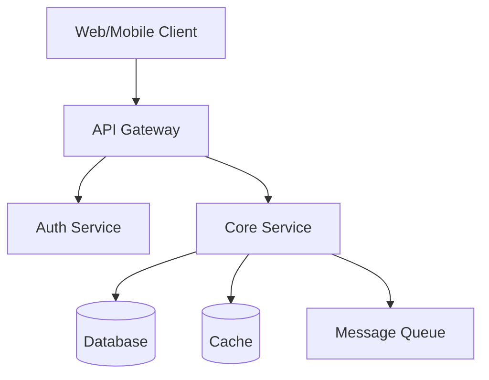

# Spec Templates

Output templates for different specification needs. Choose based on project size and complexity.

## Standard Feature Spec (Full)

Use for features requiring 1+ weeks of work.

```markdown
# [Feature Name] — Specification

Generated: [date]
Source: Claude Interview Session
Status: Draft — Pending Review

---

## 1. Overview

[One paragraph: what this is, who it's for, why it matters.
Should be understandable by anyone in 30 seconds.]

### Success Criteria

- [ ] [Measurable criterion 1]
- [ ] [Measurable criterion 2]
- [ ] [Measurable criterion 3]

---

## 2. User Stories

### Primary (Must Have)

**US-1: [Story Title]**
- **As a** [persona]
- **I want to** [action]
- **So that** [outcome/benefit]

**Acceptance Criteria:**
- [ ] [Testable criterion]
- [ ] [Testable criterion]

**US-2: [Story Title]**
...

### Secondary (Should Have)

**US-3: [Story Title]**
...

### Edge Cases (Could Have)

**US-4: [Edge Case Story]**
- **As a** [persona]
- **When** [unusual condition]
- **I expect** [graceful behavior]

---

## 3. Technical Architecture

### System Diagram



### Data Model

**Entity: [EntityName]**
| Field | Type | Constraints | Description |
|-------|------|-------------|-------------|
| id | UUID | PK | Unique identifier |
| name | string | NOT NULL, max 100 | Display name |
| created_at | timestamp | NOT NULL | Creation time |
| ... | ... | ... | ... |

**Relationships:**
- [Entity A] 1:N [Entity B]
- [Entity C] N:M [Entity D] (via [JoinTable])

### API Endpoints

**POST /api/v1/[resource]**
- **Purpose**: Create new [resource]
- **Auth**: Bearer token required
- **Request Body**:
  ```json
  {
    "name": "string",
    "config": {}
  }
  ```
- **Response 201**:
  ```json
  {
    "data": {
      "id": "uuid",
      "name": "string",
      "created_at": "timestamp"
    }
  }
  ```
- **Errors**: 400 (validation), 401 (auth), 409 (conflict)

### Infrastructure

| Component | Technology | Justification |
|-----------|------------|---------------|
| Compute | [Vercel/AWS/GCP] | [Why] |
| Database | [Postgres/MongoDB] | [Why] |
| Cache | [Redis/Memcached] | [Why] |
| Queue | [SQS/RabbitMQ] | [Why] |

---

## 4. UI/UX Specification

### Screen Inventory

| Screen | Primary Action | Data Displayed |
|--------|---------------|----------------|
| Dashboard | View summary | Stats, recent items |
| List View | Browse/Search | Paginated items |
| Detail View | Edit/Delete | Full item data |
| Create Form | Submit new | Input fields |
| Settings | Configure | User preferences |

### User Flow: [Primary Flow Name]

```
[Screen 1] → [Action] → [Screen 2] → [Action] → [Screen 3]
    ↓ (error)              ↓ (cancel)
[Error State]          [Confirmation]
```

### Screen States

**[Screen Name]**
| State | Description | User Action |
|-------|-------------|-------------|
| Loading | Skeleton UI, spinner | Wait |
| Empty | No data yet | CTA to create first |
| Partial | Some data loaded | Can interact |
| Full | All data loaded | Full interaction |
| Error | Something failed | Retry button |
| Offline | No connection | Cached view + banner |

### Responsive Breakpoints

| Breakpoint | Layout Changes |
|------------|----------------|
| Mobile (<640px) | Single column, bottom nav |
| Tablet (640-1024px) | Two column, collapsible sidebar |
| Desktop (>1024px) | Full layout, persistent sidebar |

---

## 5. Edge Cases & Error Handling

| Scenario | Expected Behavior | Recovery |
|----------|-------------------|----------|
| Network timeout | Show error toast, preserve input | Retry button |
| Invalid input | Inline validation error | Clear error on fix |
| Concurrent edit | Show conflict dialog | Merge or overwrite |
| Rate limited | Disable action, show countdown | Auto-retry |
| Session expired | Redirect to login, preserve URL | Return after login |
| [Specific edge case] | [Behavior] | [Recovery] |

---

## 6. Security & Compliance

### Authentication

- [ ] [Auth method: JWT / Session / OAuth]
- [ ] Token expiration: [duration]
- [ ] Refresh token strategy: [approach]

### Authorization

| Role | Permissions |
|------|-------------|
| Admin | Full access to all resources |
| User | Own resources only |
| Guest | Read-only public resources |

### Data Protection

- [ ] Encryption at rest: [Yes/No, method]
- [ ] Encryption in transit: [TLS version]
- [ ] PII handling: [approach]
- [ ] Data retention: [duration]
- [ ] Right to deletion: [supported]

### Compliance

- [ ] GDPR: [applicable / not applicable / requirements]
- [ ] SOC2: [applicable / not applicable]
- [ ] HIPAA: [applicable / not applicable]
- [ ] Other: [requirements]

---

## 7. Performance Requirements

| Metric | Target | Measurement |
|--------|--------|-------------|
| Page Load (LCP) | < 2.5s | Lighthouse |
| Time to Interactive | < 3.5s | Lighthouse |
| API Response (p95) | < 200ms | APM |
| Database Query (p95) | < 50ms | Query logs |
| Error Rate | < 0.1% | Monitoring |
| Uptime | 99.9% | Health checks |

### Scalability

- Expected users: [current] → [1 year]
- Expected data volume: [current] → [1 year]
- Scaling strategy: [horizontal / vertical / auto]

---

## 8. Implementation Phases

### Phase 1: MVP (Week 1-2)

**Scope**: Minimum shippable version

- [ ] [Feature 1] — Core functionality
- [ ] [Feature 2] — Essential flow
- [ ] [Feature 3] — Basic error handling

**Definition of Done**: User can [complete primary action]

### Phase 2: Enhancement (Week 3-4)

**Scope**: Core improvements

- [ ] [Feature 4] — Better UX
- [ ] [Feature 5] — Edge case handling
- [ ] [Feature 6] — Performance optimization

**Definition of Done**: User can [complete action smoothly]

### Phase 3: Polish (Week 5+)

**Scope**: Nice-to-haves

- [ ] [Feature 7] — Delightful touches
- [ ] [Feature 8] — Power user features
- [ ] [Feature 9] — Analytics & insights

---

## 9. Open Questions

**[Question 1]: [Detailed question]**
- Impact: [What's blocked if unanswered]
- Owner: [Who should answer]
- Deadline: [When needed by]

**[Question 2]: [Detailed question]**
...

---

## 10. Risks & Mitigations

| Risk | Likelihood | Impact | Mitigation |
|------|------------|--------|------------|
| [Technical risk] | Medium | High | [Approach] |
| [Business risk] | Low | Critical | [Approach] |
| [Timeline risk] | High | Medium | [Approach] |

---

## 11. Dependencies

### External Dependencies

| Dependency | Type | SLA | Fallback |
|------------|------|-----|----------|
| [Third-party API] | API | 99.9% | Cache / queue |
| [Payment provider] | Service | 99.95% | Queue + retry |
| [Auth provider] | Service | 99.99% | N/A (blocking) |

### Internal Dependencies

| Dependency | Owner | Status | ETA |
|------------|-------|--------|-----|
| [Shared component] | Team A | In progress | Week 2 |
| [API endpoint] | Team B | Not started | Week 3 |

---

## Appendix: Decision Log

| Date | Decision | Rationale | Alternatives Considered |
|------|----------|-----------|------------------------|
| [date] | [What was decided] | [Why] | [What else was considered] |
```

---

## Quick Spec (< 1 Week)

Use for small features or bug fixes requiring less than 1 week.

```markdown
# [Feature Name] — Quick Spec

**Status**: Draft
**Author**: [name]
**Date**: [date]

---

## What

[2-3 sentences describing what this feature does]

## Why

[1-2 sentences explaining the motivation or problem being solved]

## How

### Technical Approach

1. [Step 1: What changes in what file/service]
2. [Step 2: What changes]
3. [Step 3: What changes]
4. [Step 4: What changes]
5. [Step 5: What changes]

### Data Changes

- [New field / table / etc., if any]
- [Migration required? Yes/No]

### API Changes

- [New/modified endpoint, if any]
- [Breaking change? Yes/No]

## Acceptance Criteria

- [ ] [Testable criterion 1]
- [ ] [Testable criterion 2]
- [ ] [Testable criterion 3]
- [ ] [Testable criterion 4]

## Edge Cases

| Scenario | Expected Behavior |
|----------|-------------------|
| [Edge case 1] | [Behavior] |
| [Edge case 2] | [Behavior] |

## Open Questions

- [ ] [Any unresolved questions]

## Out of Scope

- [What this spec explicitly does NOT cover]
```

---

## API Spec Template

Use when designing a new API or endpoint.

```markdown
# [API Name] — Specification

**Version**: 1.0.0
**Status**: Draft
**Date**: [date]

---

## Overview

[Brief description of what this API does and who uses it]

## Authentication

- **Type**: [Bearer token / API key / OAuth]
- **Header**: `Authorization: Bearer <token>`
- **Scope required**: [scope, if applicable]

---

## Endpoints

### [Verb] /api/v1/[path]

**Purpose**: [What this endpoint does]

**Request**

| Parameter | Location | Type | Required | Description |
|-----------|----------|------|----------|-------------|
| id | path | UUID | Yes | Resource ID |
| limit | query | integer | No | Max results (default: 20) |
| filter | query | string | No | Filter criteria |

**Request Body** (for POST/PUT/PATCH)

```json
{
  "name": "string (required, 1-100 chars)",
  "config": {
    "option1": "boolean (optional, default: false)"
  }
}
```

**Response 200**

```json
{
  "data": {
    "id": "uuid",
    "name": "string",
    "created_at": "ISO8601 timestamp"
  },
  "meta": {
    "request_id": "string"
  }
}
```

**Error Responses**

| Status | Code | Message | When |
|--------|------|---------|------|
| 400 | VALIDATION_ERROR | Invalid input | Validation fails |
| 401 | AUTH_REQUIRED | Authentication required | No token |
| 403 | FORBIDDEN | Access denied | Insufficient permissions |
| 404 | NOT_FOUND | Resource not found | ID doesn't exist |
| 409 | CONFLICT | Resource conflict | Duplicate |
| 429 | RATE_LIMITED | Too many requests | Rate limit exceeded |
| 500 | INTERNAL_ERROR | Internal server error | Unexpected error |

---

## Rate Limiting

| Limit | Window | Scope |
|-------|--------|-------|
| 100 | 1 minute | Per user |
| 1000 | 1 hour | Per user |
| 10000 | 1 day | Per organization |

**Headers**:
- `X-RateLimit-Limit`: Total allowed
- `X-RateLimit-Remaining`: Remaining
- `X-RateLimit-Reset`: Reset timestamp

---

## Pagination

**Request**:
- `page`: Page number (1-indexed)
- `per_page`: Items per page (default: 20, max: 100)

**Response**:
```json
{
  "data": [...],
  "meta": {
    "page": 1,
    "per_page": 20,
    "total": 150,
    "total_pages": 8
  },
  "links": {
    "self": "/resource?page=1",
    "next": "/resource?page=2",
    "prev": null,
    "first": "/resource?page=1",
    "last": "/resource?page=8"
  }
}
```

---

## Webhooks (if applicable)

### Events

| Event | Trigger | Payload |
|-------|---------|---------|
| resource.created | New resource | Full resource object |
| resource.updated | Resource modified | Changed fields |
| resource.deleted | Resource removed | ID only |

### Delivery

- **Retry policy**: 3 attempts with exponential backoff
- **Signature**: HMAC-SHA256 in `X-Webhook-Signature` header
- **Timeout**: 30 seconds

---

## Versioning

- Current version: v1
- Deprecation policy: 6 months notice
- Breaking changes: New major version only
```

---

## Bug Fix Spec Template

Use for documenting bug fixes.

```markdown
# Bug Fix: [Brief Description]

**Ticket**: [JIRA/GitHub issue link]
**Priority**: [Critical / High / Medium / Low]
**Date**: [date]

---

## Problem

**Expected behavior**: [What should happen]

**Actual behavior**: [What actually happens]

**Reproduction steps**:
1. [Step 1]
2. [Step 2]
3. [Step 3]
4. Observe: [the bug]

**Affected users**: [Percentage / count / specific conditions]

## Root Cause

[Technical explanation of why this happens]

## Fix

**Approach**: [Brief description of the fix]

**Changes**:
1. [File 1]: [What changes]
2. [File 2]: [What changes]

**Regression risk**: [Low / Medium / High — explain]

## Testing

- [ ] Unit test for [specific scenario]
- [ ] Integration test for [flow]
- [ ] Manual test: [steps]

## Verification

After deploy, verify:
- [ ] [Check 1]
- [ ] [Check 2]
- [ ] Monitor [metric] for [duration]
```
